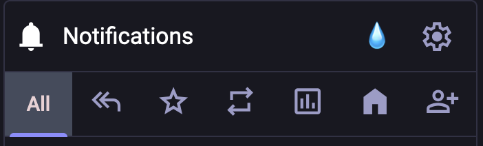

# Mastodon Clear Columns (on Button Click)

## Description

This Tampermonkey script adds a clickable icon to each Mastodon column header, allowing users to hide all articles within that column. It's a lightweight and convenient way to declutter your Mastodon interface without permanently removing content—articles can be hidden with a single click.

## Features

- Adds an icon (💧) to Mastodon column headers.
- Hides all articles in a column when the icon is clicked.
- Works dynamically: new articles remain visible until the icon is clicked again.
- Prevents duplicate icons by adding them only once per column.
- Automatically handles columns added to the page dynamically.

## Installation

1. Install [Tampermonkey](https://www.tampermonkey.net/) in your browser if you haven’t already.
2. Create a new script and copy-paste the code from the `Hide Articles in Mastodon Column on Button Click` repository.
3. Save and enable the script.
4. Visit Mastodon, and you'll see the 💧 icon in each column header.

## Usage

- Once installed, the script will add a 💧 icon next to the column header buttons in your Mastodon interface.
- Click the icon to hide all articles within the respective column.
- New articles added to the column dynamically will remain visible until you click the icon again.

## Compatibility

- Mastodon instances: `sueden.social`, `chaos.social`, `mastodon.social`.
- Works on other Mastodon instances as well (by modifying the `@match` rules).
- tested with Mastodon v4.3.0

## Screenshot

Below is an example of the interface with the added icon:

## License

This project is licensed under the MIT License - see the [LICENSE](LICENSE) file for details.

## Contributions

Feel free to submit issues or pull requests if you'd like to contribute to improving the script.